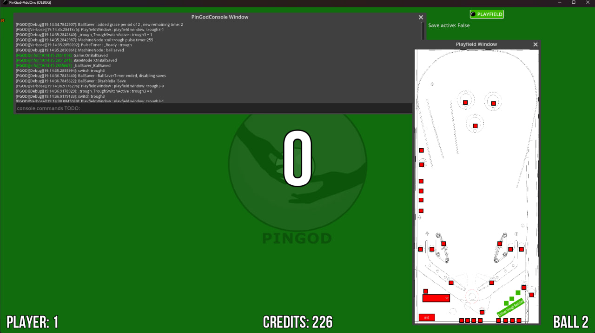

# PinGod-AddOns
   

`Godot 4.3-Mono` engine addons, framework for creating a pinball display with logic. 

### AddOns
_* Autoload_ = plugin has an Autoload singleton. You can access these singletons from any script from the root. The main scenes can be overrided by duplicating the main scene for the Autoload and place into `res://autoload`, eg: `res://autoload/Resources.tscn`.

| Name | Autoload *  | Description | Link 
| --- | --- | --- |---|
| pingod-core  | no | Base classes for the modules   | [link](./addons/pingod-core) 
| pingod-assets  | no | Assets used by the modules. Localization for your game | [link](./addons/pingod-assets) 
| pingod-controls  | no | Godot addin controls  | [link](./addons/pingod-controls) 
| pingod-misc | no | Others scenes and layers | [link](./addons/pingod-misc) 
| pingod-modes | no | Scenes and game modes, overlays | [link](./addons/pingod-modes) 
| pingod-audio  | yes | audio manager / player   | [link](./addons/pingod-audio) 
| pingod-game  | yes | PinGodGame, Game and Main scenes. Demo uses the Main scene, which also uses the game and modes module  | [link](./addons/pingod-game) 
| pingod-machine | yes | Machine manager for pinball machine items, events | [link](./addons/pingod-machine) 
| pingod-memorymap-win | yes |Sharing machine states over memory mapping (**windows only**)    | [link](./addons/pingod-memorymap-win) 
| pingod-resources | yes | Resource loader, pre load scenes and `pck` files| [link](./addons/pingod-resources) 
| pingod-windows | yes | Input handling and switch windows + custom windows| [link](./addons/pingod-windows) 

### Quick Start - Players Test Game Build (Windows)
1. Download a `pingod-addons-gamebuild.zip` from [releases](https://github.com/FlippingFlips/pingod-addons/releases)
2. Extract files and run the `win.exe`

3. Add coins with key `5` or use the switch window.
4. Fill the ball trough with the big switch and click `start` and drain each ball to finish the game.

5. You can build games from this by installing the `addons.zip` to your game.
The BasicGame project builds on from this for an example.

### Godot install
* [Godot 4.3](https://godotengine.org/): `choco install godot-mono`

#### Quick Start Installing Into a Godot Project
1. Download the `pingod-addons.zip` from release
2. Create a new Godot project (from running Godot by itself or creating an empty `project.godot` file in a folder and loading it with `godot -e`)
3. Open the `AssetLib` in Godot from the middle pane and import the `pingod-addons.zip`
4. Create a new `C#` script in Godot. Godot will create you a `.csproj` and make it mono compatible, you can delete this after.
5. A `build` button will appear top right in Godot. Build it.
6. Enable the plugins in Godot. `Project Settings > Plugins`
7. Create a blank scene and launch the game. `ESC` or `F8` to close window.
8. Instance a default [MainScene.tscn](addons/pingod-game/Node/MainScene.tscn) as a child in your blank scene and launch game with attract / game.

## Running the Demo in this repository
This demo is just an empty scene with a `MainScene.tscn` added.
The main scene instanced here is the default game and attract.
1. Clone the repo or download it
2. Run `godot -e` in the repository to load the `project.godot` into the Godot editor.
3. Build and Launching the game will display loading screen with resources and display an attract scene when complete.
4. With a switch window enabled you can simulate switch presses and run through a full 3 ball game.

### Required For Development
* [Dotnet SDK](https://dotnet.microsoft.com/en-us/download): `choco install dotnet-sdk`

---
#### Using this repository for new game
1. Rename the `.sln`, `.csproj`, `.csproj.user`
2. Change the `project/assembly_name` in the [project.godot](project.godot)
3. Change `config/name` , `config/description` in the [project.godot](project.godot)

#### Window - Godot Project Settings
* Window - Set your main display size
* Window - Use the `advanced settings` to change the override width and height if you want to test lower or larger than your main resolution.
* Window - Always on top, Resize, Borderless
* Window - If overriding set stretch modes

*Simulator can override display properties with godot arguments from script or properties in script on the controller*

---
#### Simulator Demos

[visual pinball](simulators/visual-pinball) - Table demonstration to run with this repositories [Demo-PinGod.tscn](Demo-PinGod.tscn)

---
#### Debugging From Visual Studio
You can launch the editor or launch the game with debug breakpoints, the same probably exists for `VSCode`.

Adjust the [launchSettings.json](Properties/launchSettings.json) for the location of the godot executable then select and run any of the modes from visual studio.

This example is wired to a windows chocolatey install: `C:\\ProgramData\\chocolatey\\lib\\godot-mono\\tools\\godot_v4.1.1-stable_mono_win64\\Godot.exe`

- You can also launch the game into the Godot editor with `(Load Godot Editor)` `Ctrl F5 no debug`