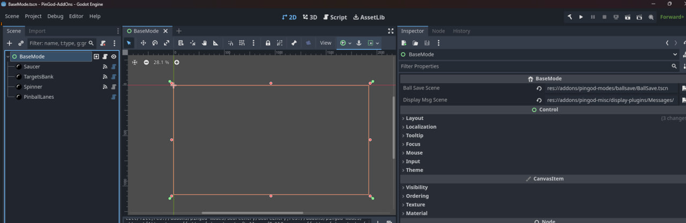

# pingod-addons demo
The only files that were created for the demo are in this demo folder and in the [autoload folder](../autoload).
The [machine.json](../machine.json) is exported from NetPinProc database and read in when the `MachineNode` runs.

We are overriding the `PinGodGame.tscn` and `Resources.tscn` from the autoload folder to add resources and add a custom game to the scene.

The main bulk of this demo game logic is in the demo/modes, [BaseMode.tscn](demo/BaseMode.tscn) scene and the [BaseMode.cs](demo/BaseMode.cs) script.

