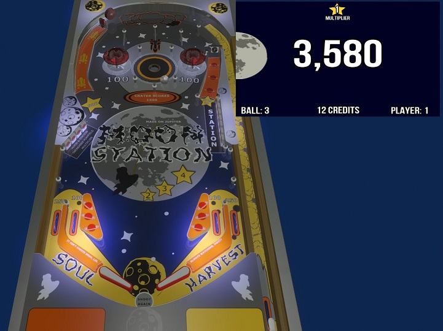
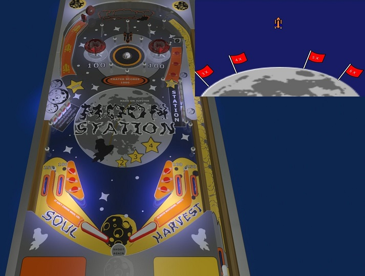
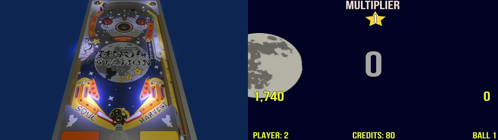

# MoonStation - PinGod
---

A simple rules table with novelty video mode using the [pingod-addons](https://github.com/FlippingFlips/pingod-addons)

❓ [Getting started > BasicGame - Setup / AddOns](https://FlippingFlips.github.io/pingod-addons/getting-started/basicgame-setup/)

### Features

- 2 Drop Target banks
- 2 Bumpers
- 2 Songs created specifically for this game (selected in menu)
- Bonus & Multipliers
- Video mode

### Setup

Extract the `assets/assets.zip`

### Visual Pinball Screens
---

Video mode: Capture flags with multiplier awards if you make it to the saucer.

