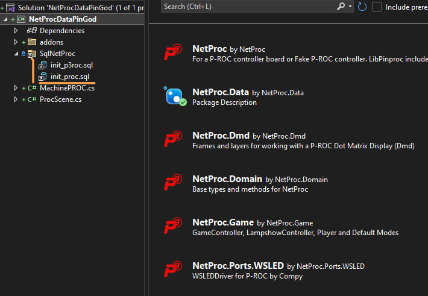

# pingod-netproc-pdb

An example running a P-ROC device or Fake P-ROC device with PinGod. This also uses `NetProc.Data` to create a database from .sql templates provided in nuget package.

## About

If you run the solution there is an added nuget source in `nuget.config` locally pointing to the `./nuget` directory and the `NetProc` libraries are installed from there.

---

You will edit one of the files depending on the machine type. 

You can copy these (linked) files into `sql` and the database will use these.

*There is a `.gdignore`, a Godot ignore file which will ignore these packages in `nuget`.*

## How it's made...

This uses a `IFakeProcDevice`, but that can be swapped with a single `simulated` flag when the game is created in the `ProcPinGodGame.cs`.

---

### `autoload\MachinePROC.cs`

- Replaces the default autoload `MachineNode` script, nothing changed from default scene.

- When this node enters the tree it creates a database and seeds it with values given in the `sql`. This is set to delete everytime it boots here, but that is only for testing and can be switched, once you have configuration of your machine you would only need to reset / delete it if you wanted to.

- `SetSwitchFakeProc` - This method adds the fake switch to the switch_events queue if it's a `IFakeProcDevice`. This gets invoked from windows keys on window with WindowActions.

- Also overrides `SetSwitch` from the machine and calls `SetSwitchFakeProc` before that base method which signals to Godot switch handlers.

---
### `proc\ProcPinGodGame.cs`

- Replaces the default autoload `PinGodGame` in `autoload/PinGodGame.tscn`

- _Ready Creates a `PinGodProcGameController`, `IGameController`

- _ExitTree cancels the P-ROC

---
### `proc\PinGodProcLogger.cs`

- P-ROC has it's own Iogger interface and is used by the game so this is just a wrapper around our logger but messages are prefixed `P-ROC:`

---

## Modes

### `modes\PinGodProcMode.cs`

- This is a Base mode using the `P-ROC` Mode / IMode.
- It has a CanvasLayer which has an integer property of `Layer`. The layer is the order drawn or visible. The P-ROC Mode priority is set here.
- It needs to get to the root scenes of Godot so a `PinGodGame` is passed in.
- When the mode is constructed it is added to the `modesRootPath`. `Modes` is a CanvasLayer that this mode should go into when instantiated.

By default is set in the mode,  `string modesRootPath = "/root/ProcScene/Modes";`

- When the mode is created, the CanvasLayer is added to the `modesRootPath` and added as a child so it will be visible.

- When a mode is removed from the `IGameController.Modes` it will invoke `ModeStopped` and here we remove our CanvasLayer from the tree.

---
### `modes\MyMode.cs`

- This uses the above abstract `PinGodProcMode`. Standard methods like `ModeStopped` and `ModeStarted` are just logged.
- There are some methods named like `sw_flipperLwL_active` and `sw_flipperLwL_active_for_1s`. These are our scanned switch methods, if pattern matches method you can write all kinds of these to act on switch events.